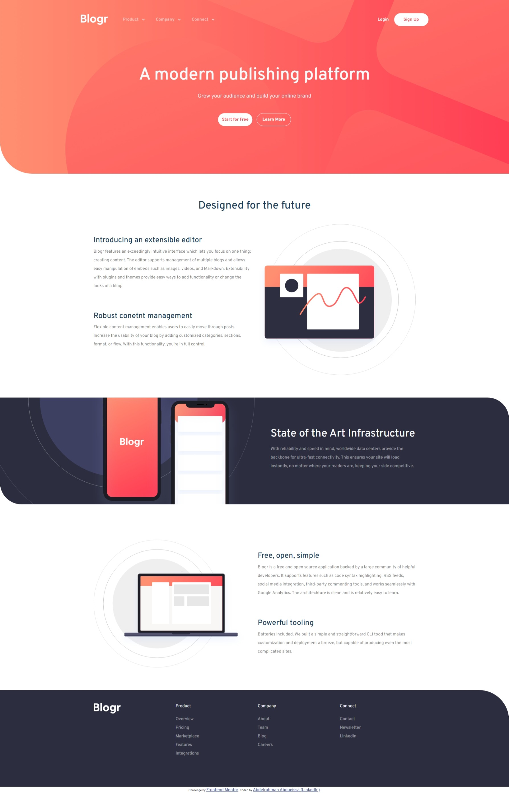

# Blogr Page Solution - Front-End Mentor

This is a solution to the [Blogr page challenge on Frontend Mentor](https://www.frontendmentor.io/challenges/blogr-landing-page-EX2RLAApP).

## Overview

-   Live Site URL: [Blogr Landing Page](https://your-live-site-url.com)
  

### Built with

-   Semantic HTML5 markup
-   CSS custom properties
-   [Bootstrap v5.3.8](https://getbootstrap.com/)

### What I learned

I've learned how to deal with frameworks such as Bootstrap, which is an essential skill in Front-End Development. I've also added/changed some of the aspects in the original design to match my own personal style in building websites. Furthermore, I have drastically improved my understanding of responsive websites and how to implement them, and the Bootstrap framework came in handy for that. Additionally I've learned to use the Bootstrap Grid System, which is considered by many individuals as a standard to use in Front-End Projects.

### Contact Me

-   LinkedIn - [Abdelrahman Aboueissa](https://www.linkedin.com/in/abdelrahman-aboueissa-694031278/)
